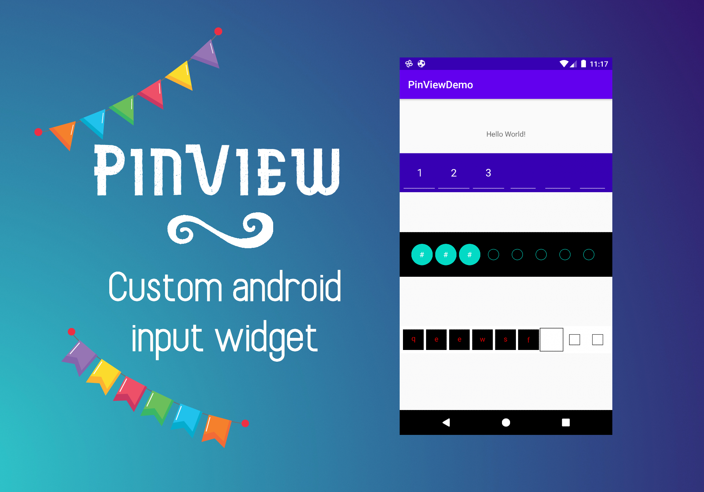

# PinView 
--------------------------------------------
**PinView** - A custom UI control written in Kotlin which is configurable by passing different attributes available, it is extended from **AppCompatEditText**.

---------------------------------------------

---------------------------------------------

# Features

- Written in kotlin
- Multiple input field shapes line, rectangle and circle 
- Customizable properties 
- Support minimum API 17
- Easy to use

# How to use?

- In build.gradle

```
    implementation 'com.apptualizer.pinview:pinview:1.0'
```

- In xml layout

```
    <com.apptualizer.pinview.PinView
        android:id="@+id/pin_view_line"
        android:layout_width="0dp"
        android:layout_height="wrap_content"
        android:background="@color/colorPrimaryDark"
        android:focusableInTouchMode="true"
        android:inputType="number"
        android:padding="4dp"
        android:text="1"
        android:textSize="20sp"
        android:textColor="@android:color/white"
        android:visibility="visible"
        app:layout_constraintVertical_bias=".2"
        app:borderColor="@android:color/white"
        app:layout_constraintLeft_toLeftOf="parent"
        app:layout_constraintRight_toRightOf="parent"
        app:layout_constraintTop_toTopOf="parent"
        app:layout_constraintBottom_toBottomOf="parent"
        app:pinLength="6"
        app:viewType="line"></com.apptualizer.pinview.PinView>
 
```

- Implement OnPinCompletionListener to get notified when input is filled

```
  pinView.setPinCompletionListener(object : OnPinCompletionListener {
        override fun onCodeCompletion(otp: String) {
            Toast.makeText(this@MainActivity, otp, Toast.LENGTH_LONG).show()
        }
  }) 
```

### Properties added in PinView

    - viewType : Use this property to configure shape of each char, 
                 There are multiple container type available as listed below
                
                 - line
                 - rectangle
                 - circle 

    - pinLength : Use this property to configure code length expected
    - mask : Use this property to enable mask for each char
    - borderColor : Use this property to configure color of border
    - borderThickness : Use this property to configure thickness of border lines
    - backgroundColor : Use this property to configure filled background color

# Sample

Clone the repository and check out the app module.

